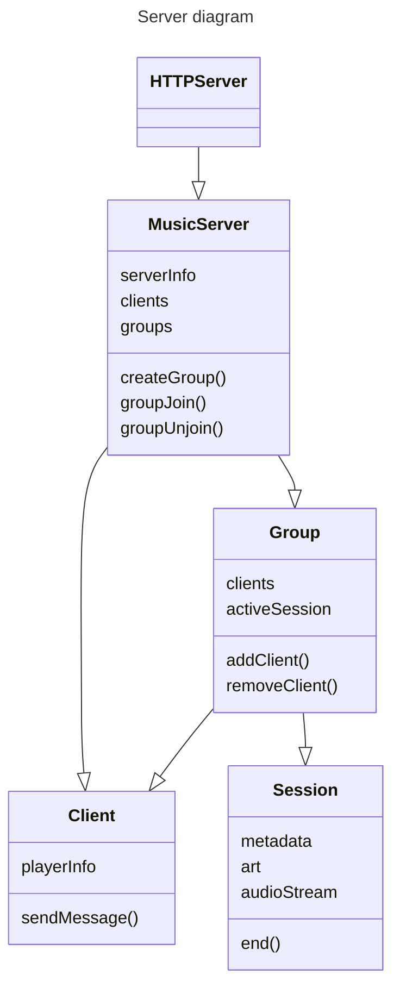

# Resonate Audio Player Example

A simple example of an audio player implementation using WebSockets.



## Getting Started

1. Install dependencies:
   ```bash
   npm install
   ```

2. Start the development server:
   ```bash
   npm run dev
   ```
   This will:
   - Watch for TypeScript changes and recompile automatically
   - Serve the app at http://localhost:3000

3. Start the demo backend on port 3001:
   ```bash
   node server.js
   ```

## Development

When running in development mode with `npm run dev`:
- TypeScript files are automatically recompiled when changed
- The web server automatically serves the latest version
- All content is served from http://localhost:3000
